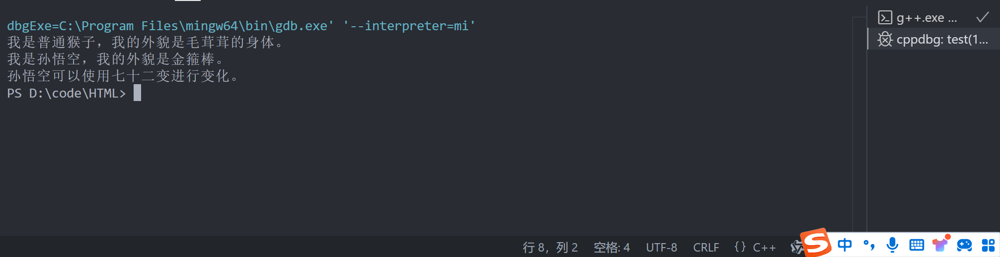

# 实验一：面向对象编程 - 封装与继承

## 实验背景

在《黑神话：悟空》的故事背景下，猴子作为一个基础模板，而孙悟空则继承了猴子的特性，并具有独特的神通。在这个实验中，我们将使用面向对象编程的思想来设计一个简单的类层次结构，展示封装和继承的概念。

## 类的设计

### 基类 `Monkey`

- **属性**：
  - `name`（名字）
  - `appearance`（外貌）

- **方法**：
  - `introduce`（介绍自己）

### 派生类 `SunWukong`

- **属性**：
  - `name`（名字）
  - `appearance`（外貌）
  - `special_powers`（特殊能力）

- **方法**：
  - `introduce`（介绍自己）
  - `transform`（七十二变）
  
### main函数运行结果



## C++ 代码实现

### 基类 `Monkey` 介绍

```cpp
#include <iostream>
#include <string>

using namespace std;

// 基类 Monkey
class Monkey {
public:
    Monkey(const string& name, const string& appearance)
        : name(name), appearance(appearance) {}

    void introduce() const {
        cout << "我是" << name << "，我的外貌是" << appearance << "。\n";
    }

protected:
    string name;
    string appearance;
}


