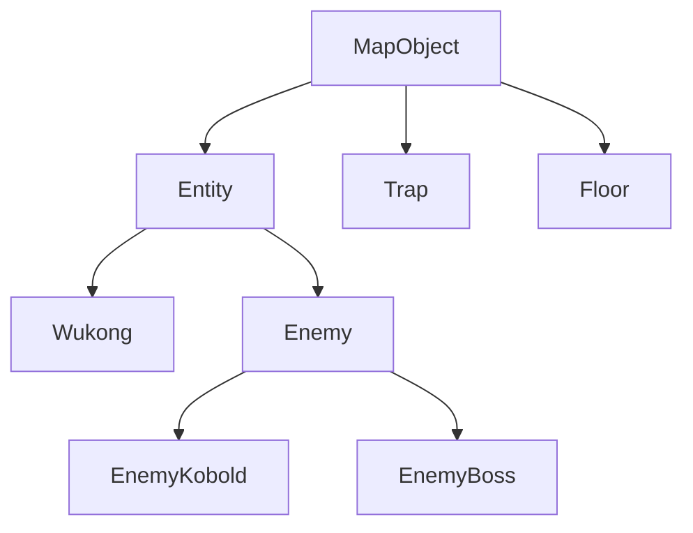

# **悟空小游戏**

## 简介
项目使用C#编写  
输入平面地图文件可以模拟悟空抓住妖怪的过程（
>`Build-(.Net8.0)`文件夹中有已经build好的exe文件（需要.Net8.0运行时）  

## 运行截图


## 用例
命令行输入：
```
Wukong.exe map.txt
```
其中`map.txt`为输入的**地图文件**，遵循以下格式：  
>倘若不存在输入的`map.txt`，程序会自动查找运行目录下是否存在map.txt文件
1. `地图的宽W` `地图的高H`
2. `H行长度为W的字符，表示地图格子`
---
> 一个输入例子：
>```
>30 10
>..............#.X.............
>.W............#...............
>..............############....
>......###.....................
>......#..######.###...........
>..###.#.......#.#..#####......
>..#...#..X....#...............
>....O.######.#.#..............
>...####.........#.......XX....
>...O.............#............
>```

符号对应关系：
|符号|对应物体|
|---|---|
|`.`|*地板*|
|`#`|*障碍物*|
|`W`|*悟空*|
|`O`|*小妖怪*|
|`X`|*头目*|
## 部分源文件说明
1. `Program.cs`  
程序入口，读入map.txt初始化地图
2. `MapManager.cs`  
地图管理单例类，负责管理地图和每Tick刷新地图
3. `MapObject.cs`  
地图上物体的基类
4. `MapObjectFactory.cs`  
工厂类，负责管理`map.txt`中符号到`MapObject`的关系
5. `Entity.cs`  
地图上实体的基类，需要被每Tick更新
6. `Enemy.cs`  
妖怪的基类
7. `Trap.cs`  
障碍物
8. `Floor.cs`  
地面
9. `Wukong.cs`  
主角悟空
10. `EnemyKobold.cs` `EnemyBoss.cs`  
两种具体的妖怪
11. `Astar.cs` `PathNode.cs` `Vector2.cs`  
实现A*寻路
## 继承关系
